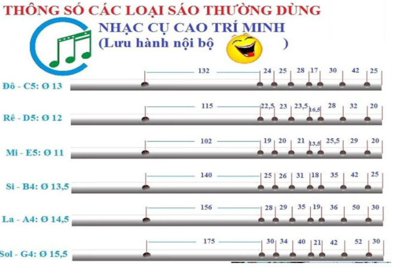
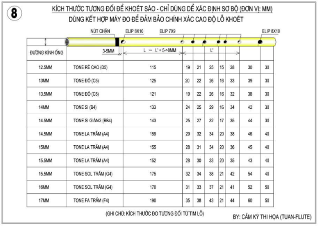

# Cách Làm Sáo

## [1 Tìm hiểu về cao độ, âm sắc, nguyên liệu trúc nứa và nguyên lý âm thanh khi làm sáo, tiêu.](#1)
### [1.1 Như thế nào là một cây sáo tốt, chuẩn và hay.](#11)
### [1.1.1 Các yếu tố ảnh hưởng đến cao độ của tiếng sáo, tiêu.](#111)
### [1.1.2 Các yếu tố ảnh hưởng đến âm sắc của tiếng sáo, tiêu.](#112)
### [1.2 Cách lựa chọn nguyên liệu (trúc nứa là chính) làm sáo tiêu tốt, phù hợp và cách xử lý trúc nứa.](#12)
### [1.2.1 Như vậy, các yếu tố về nguyên liệu ảnh hưởng đến âm sắc sẽ là:](#121)
### [1.2.2 Sự ảnh hưởng của trúc nứa (nguyên liệu làm sáo chủ yếu) đến âm thanh của sáo.](#122)
### [1.2.3 Cách chọn và xử lý trúc nứa để chế tạo tiêu sáo tốt nhất.](#123)
### [1.3 Kiến thức để làm tiêu sáo:](#13)
### [1.4 Yêu cầu cần và đủ để có thể chế tạo tiêu sáo (sáo trúc):](#14)
## [2 Chế tạo sáo trúc, sáo nứa và động tiêu.](#2)
### [2.1 Dụng cụ để làm tiêu sáo (sáo trúc):](#21)
### [2.2 Các bước chế tạo sáo, tiêu.](#22)
### [2.3 Các công thức tính toán làm sáo, tiêu.](#23)
### [2.3.1 Công thức tính toán theo cung khi làm sáo tiêu:](#231)
### [2.3.2 Công thức tính toán chuẩn của phương Tây.](#232)
### [2.3.3 Cách hiệu chỉnh sai số khi tính toán hoặc áp dụng mẫu để chế tạo sáo tiêu:](#233)
### [2.3.4 Ảnh hưởng của nút chặn trong chế tạo sáo, tiêu.](#234)
### [2.4 Cách làm sáo trúc, động tiêu dể lên quảng 3.](#24)
### [2.5 Cuối cùng, mình xin góp ý, chia sẽ các bước để làm một cây sáo chuẩn như sau:](#25)
#

##  1 Tìm hiểu về cao độ, âm sắc, nguyên liệu trúc nứa và nguyên lý âm thanh khi làm sáo, tiêu.

Đầu tiên chúng ta cần biết “như thế nào là một cây sáo chuẩn và hay”.

**Như thế nào là một cây sáo tốt, chuẩn và hay.**

Người ta sẽ nhận diện một cây sáo tốt thông qua hình thức và âm thanh, trong đó âm thanh được xem trọng hơn.

Về hình thức: hình thức của sáo, tiêu là các yếu tố như độ tròn, độ thẳng, hình thức vỏ sáo, màu sắc, cách   trang trí và sự tỉ mĩ, cân đối của lỗ khoét. Yếu tố về hình thức, thẫm mĩ của cây sáo, tiêu sẽ ảnh hưởng 1 phần   đến giá trị và giá cả cây sáo. Các yếu tố như độ tròn, độ thẳng còn có ảnh hưởng đến âm thanh, (tròn thẳng   sẽ tốt cho âm thanh) tuy nhiên, người làm sáo có kinh nghiệm sẽ biết cách để khắc phục các nhược điểm của cây sáo bị méo và cong, thậm chí có thể xem đó là một lợi thếkhi chế tạo).

Về âm thanh: Âm thanh của sáo là điểm quan trọng nhất để đánh giá giá trị và giá cả của cây sáo trúc, tiêu. Yếu   tố âm thanh được chia làm 2 phần là độ chuẩn và độ hay.

###  1.1 Như thế nào là một cây sáo tốt, chuẩn và hay.

- Về độ chuẩn: Độ chuẩn của sáo cần có để sáo có thể thể hiện đúng các nốt nhạc, giai điệu, nghe hài hòa và   không phô khi hòa beat, hòa tấu. Để kiểm tra độ chuẩn người ta sẽ sử dụng đến các công cụ đo cao độ (tần   số âm thanh) là các phần mềm tuner hoặc máy đo tuner, hoặc so sánh với đàn piano, test với beat nhạc. Tuy   nhiên, sáo, tiêu khác với các nhạc cụ khác như đàn guitar, piano vì sáo trúc, tiêu thuộc bộ hơi nên cao độ   sẽ phụ thuộc vào hơi (hơi mạnh hơn thì cao hơn, ngửa sáo ra thì cao hơn). Do vậy, cao độ của một nốt trên   cùng 1 cây sáo có thể chênh lệch nhau với những người thổi khác nhau và cách thổi khác nhau (sự chênh lệch   có thể lên đến 1/2 cung – khoảng cách từ 2 nốt nhạc thăng giáng liền kề). Thậm chí, cùng một người, nhưng   thổi buổi sáng sẽ khác, buổi chiều sẽ khác buổi trưa sẽ khác vì thể lực, hệ hô hấp sẽ không ổn định. Ngoài   ra, nhiệt độ cũng ảnh hưởng đến cao độ của sáo, nhiệt độ cao hơn thì vận tốc âm thanh cao hơn nên tần số   sẽ cao hơn (Tuy nhiên, khi các bạn biết làm nóng sáo và thổi hơi ấm vào lòng sáo thì sự ảnh hưởng của   nhiệt độ môi trường sẽ bớt đi vì nhiệt độ của luồng hơi của người luôn là 37 độ C).

- Về độ hay (âm sắc và độ đầm vang): Âm sắc là đặc trưng sinh lý của âm thanh. Cùng một cao độ, cùng một bản   nhạc, nhưng khi người này hát ta sẽ nghe khác người kia hát, khi nhạc cụ này chơi ta sẽ nghe khác nhạc cụ   kia chơi, điều này là do các nhạc cụ khác nhau sẽ có âm sắc khác nhau. Cùng là sáo, là tiêu nhưng các cây   sáo khác nhau lại có âm sắc khác nhau ít nhiều. Độ hay ở sáo và tiêu được xét đến với 2 yếu tố là độ đầm   vang và âm sắc (màu âm ngọt, êm, nhẹ, ấm, rền …) của tiếng sáo. Điều này phụ thuộc vào cả nguyên liệu làm   sáo, tiêu và cách chế tạo.

###  1.1.1 Các yếu tố ảnh hưởng đến cao độ của tiếng sáo, tiêu.

- Các yếu tố về hơi, cách đặt môi và góc hơi: Hơi khỏe hơn, đặt môi để hở phần lỗ thổi sáo nhiều hơn, và góc   hơn ngửa hơn (ngửa sáo ra) thì âm cao hơn. Hơi càng khỏe, càng ngữa môi, càng để hở lỗ thổi nhiều thì các   nốt cao sẽ bị ảnh hưởng nhiều hơn các nốt thấp.

- Các yếu tố về nguyên liệu: Lòng trong sáo không đều, độ dày thành sáo khác nhau sẽ ảnh hưởng đến cao độ của   các nốt khác. Để khắc phục chúng ta có thể thay đổi vị trí các lỗ bấm phù hợp nhưng khi lòng sáo không đều   (các mắt trúc chưa được thông sạch, lòng sáo bị biến dạng, uốn lượn) có thể làm tăng giảm độ lệch quảng   của sáo. Vậy nên cách tốt nhất là xử lý lòng trong của sáo, tiêu tốt nhất có thể khi làm sáo, tiêu.

- Các yếu tố về chế tạo: Quy tắc của chế tạo sáo là càng gần lỗ thổi thì âm càng cao và lỗ thổi, lỗ bấm càng to   thì âm càng cao. Nút chặn càng xa thì quảng 2 sẽ càng non so với quảng 1, các nốt cao sẽ càng non so với   các nốt thấp.

###  1.1.2 Các yếu tố ảnh hưởng đến âm sắc của tiếng sáo, tiêu.

- Yếu tố về nguyên liệu: nguyên liệu tốt sẽ cho âm sắc tốt. Nhưng như thế nào là tốt???

- Yếu tố về chế tạo: cách khoét lỗ cũng ảnh hưởng đến âm sắc của cây sáo, tiêu. Lỗ dài thì âm sẽ dẹt hơn, lỗ   tròn thì âm sẽ tròn hơn, lỗ to thì âm vang hơn, lỗ bé thì âm bí hơn. Tuy nhiên, còn phụ thuộc vào hơi của   từng người và kích thước lòng ống nữa. Nếu lỗ to mà hơi yếu hoặc lòng ống bé thì âm sẽ càng xì và lỗ to   quá thì rất tốn hơi.

- Yếu tố về người chơi: Âm sắc phụ thuộc vào cả người chơi sáo, tiêu, hơi đầy và khỏe, ém hơi, nén hơi tốt sẽ   cho âm sắc tiếng sáo đẹp hơn. Ngoài ra, các cao thủ còn biết cách thay đổi thế môi, hay sử dụng lưỡi,  họng, … để thay đổi 1 phần âm sắc của tiếng sáo.

###  1.2 Cách lựa chọn nguyên liệu (trúc nứa là chính) làm sáo tiêu tốt, phù hợp và cách xử lý trúc nứa.

Như phần trên đã nói về các yếu tố về nguyên liệu có ảnh hưởng đến độ chuẩn và âm sắc của tiếng sáo, tiêu. Ở   phần này, mình sẽ nói rõ hơn về sự ảnh hưởng của nguyên liệu đến âm sắc của sáo, tiêu.

Về cơ bản, âm của tiếng sáo sẽ bao gồm âm của không khí trong sáo và âm của thành sáo, cột không khí trong sáo   sẽ dao động dựa trên đường kính ống sáo, khoảng cách lỗ và sự phản xạ âm trong lòng sáo.

Đọc bài viết sau để hiểu đầy đủ hơn.

###  1.2.1 Như vậy, các yếu tố về nguyên liệu ảnh hưởng đến âm sắc sẽ là:

- Độ to của ống sáo: ống sáo càng to thì âm sẽ nghe trầm ấm hơn, to hơn và vang hơn vì sẽ có nhiều đường truyền   dao động khác nhau trong lòng ống. Chúng ta cứ tưởng tưởng trên 1 con đường bị giới hạn bởi 2 lề đường,   thì người ta có thể di chuyển thẳng từ điểm này đến điểm kia, hoặc đi các lối đi cong khác nhau để đến   điểm còn lại. Nếu đường to thì người ta sẽ có nhiều lối đi hơn đường nhỏ. Do vậy, ống sáo to, sẽ có nhiều   đường truyền dao động hơn, tạo ra các tần số khác nhau hơn và làm cho tiếng sáo ấm hơn, đầm đầm hơn.

- Sự phản xạ âm thành sáo và âm sắc của thành sáo: đó là độ dẻo, độ đàn hồi và độ chắc của thành sáo. Khi thành   sáo có độ đàn hồi tốt, lòng trong của ống sáo phẳng hơn nhẵn hơn, sự phản xạ âm sẽ tốt hơn làm cho tiếng   sáo đầm, vang hơn, và thường thì tiếng sáo cũng sẽ đanh hơn vì âm của thành sáo dao động cũng sẽ đanh  (tiếng sáo đanh là do tần số phụ cao hơn tần số chính nhiều). Khi thành sáo dẻo kèm theo sự đàn hồi kém hơn,   lòng trong không nhẵn và mềm khiến âm bí hơn, nhỏ và kém vang. Thành sáo bị xốp sẽ hấp thụ âm và làm tiếng   sáo có nhiều tạp âm, bí âm. Thành sáo mỏng tiếng sáo sẽ vang hơn, dể lên cao hơn (mỏng thì dễ dao động   hơn, phản xạ âm cũng tốt hơn) nhưng thành sáo mỏng sẽ làm cho tiếng sáo sẽ xì nhiều ở lỗ thổi và âm sắc   cũng mỏng theo.

###  1.2.2 Sự ảnh hưởng của trúc nứa (nguyên liệu làm sáo chủ yếu) đến âm thanh của sáo.

Trúc nứa được cấu tạo bởi các sợi, bó trúc nứa dọc theo thân của sáo, các bó trúc nứa sẽ cứng cáp dần từ trong   ra ngoài. Các sợi trúc nứa bé sẽ tạo thành từng bó, các bó sẽ kết lại thành ống trúc nứa. Có sợi nứa cứng,   đàn hồi hơn, có sợi nứa dẻo hơn, mềm hơn và chúng được kết lại với nhau bằng lớp nhựa trong trúc và nứa.   Khi trúc nứa đang tươi, sẽ có nhiều nước. Khi chúng ta chọn trúc nứa làm sáo, chúng ta thường khoét thử,   cắt thử và xem thớ trúc nứa để biết chất trúc nứa có tốt để làm sáo trúc, sáo nứa và tiêu không.

Kết cấu của các sợi trúc nứa và đặc tính (độ dẻo, độ cứng, độ đàn hồi, …) của nó sẽ ảnh hưởng đến âm thanh của   trúc nứa.

###  1.2.3 Cách chọn và xử lý trúc nứa để chế tạo tiêu sáo tốt nhất.

Để trúc nứa tốt nhất, phù hợp nhất đề làm sáo chúng ta cần chọn những ống trúc nứa có độ đàn hồi, độ cứng, đanh   phù hợp. Nếu trúc nứa cứng và đanh quá sẽ cho âm đanh quá, thiếu đi sự mềm mại, mất đi cảm xúc trong tiếng   sáo, tiếng tiêu. Nếu trúc nứa non, nhẹ và xốp thì âm của sáo sẽ bí, xì, nhiều tạp âm. Ngoài ra, độ dày và   kích thước lòng phải phù hợp theo từng tone sáo, tiêu khác nhau.

**Các quy tắc chọn trúc nứa làm tiêu sáo:**

- Tone sáo càng trầm thì chọn lòng ống càng to và càng dày.

- Tone sáo cao hơn thì cần độ đàn hồi tốt hơn, chất trúc nứa đanh hơn, vì tone cao sẽ khó thổi nốt thấp, các   nốt quảng 8 thứ 1 như Đô1, Rê1, … nên cần chất trúc nứa có độ đàn hồi tốt để thổi rõ, đầm các nốt đó, và   cũng cần sự trong trẻo, véo von hơn.

**Các quy tắc trong xử lý trúc nứa chế tạo tiêu sáo:**

- Làm khô (phơi nắng, hun khói – gác bếp – luộc, hấp, …) phải đảm bảo không quá vội gây nứt, toác và rỗng ống   trúc nứa nhưng cũng không nên quá lâu sẽ ủ nước làm mục và trúc nứa phơi thiếu nắng sẽ có màu không đẹp.

**Các phương pháp xử lý trúc nứa chế tạo sáo, tiêu:**

- **Phơi nắng:** Phơi nắng cũng là một hình thức ép cho trúc nứa khô nhanh hơn nhưng chậm hơn hun khói (cái này   cùng tùy nắng to không và bếp có hay sử dụng không). Phơi nắng vừa đủ sẽ cho màu đẹp, sáng và ảnh hưởng ít  đến độ rỗng của các thớ trúc nứa.
- **Hun khói:** hun khói là hình thức để trúc nứa trên bếp củi (hun chậm), hoặc lò hun (hun nhanh). Hun khói sẽ   làm cho trúc nứa nhanh khô, mất nhựa, và có màu nâu đen. Hun khói có thể chống mối mọt về sau, một phương   pháp chống mối mọt rất tốt.
- **Để trong nhà:** Để trong nhà giúp trúc nứa khô chậm nhất, nó có vẽ tốt, nhưng cũng có khá khá nhược điểm   như: ẩm mốc, màu sắc, thời gian khô, … Việc nước ở trong ống trúc nứa quá lâu cũng không tốt khi mà nó sẽ   làm thớ nứa bị mục đi phần nào.
- **Ngâm hoặc bôi dầu bóng:** Phương pháp này ít được sử dụng, và thường được sử dụng cho các tiêu sáo dòng đắt   tiền. Loại dầu bóng được ngâm, bôi vào lòng sáo cần thiết là một loại dầu bóng an toàn, không độc hại, tạo   được độ bóng để phản xạ âm tốt và ít ngăn cản việc ngấm và thoát nước bọt.
- **Ngậm muối:** Có thể ngâm muối, hoặc ngậm muối trong lòng ống trúc nứa. Theo mình thì nên bỏ qua việc ngâm   bởi ngâm nước lâu là không tốt (mục thớ, xấu màu võ,…). Việc bỏ muối khô trong lòng trúc nứa là khá tốt,   nhưng cần nhiều thời gian để muối ngấm vào trúc nứa (tầm 1 tháng trở lên). Việc ngậm muối sẽ có tác dụng   khi thổi thì lòng sáo sẽ nhanh bị ướt hơn, muối cũng làm lấp đi các lỗ hổng.
- **Luộc nứa trúc:** Việc luộc nứa trúc sẽ làm cho trúc nứa nhanh khô hơn do lớp nhựa bị mất đi thì nước sẽ dể   thoát hơi hơn. Phương pháp này thường áp dụng dể làm xổi, làm nhanh.
- **Sấy trúc nứa:** Phương pháp này ít được sử dụng ở Việt Nam do không có trang thiết bị, nhưng ở Trung Quốc   hình như được áp dụng. Việc sấy khô là rất tốt nếu được áp dụng khi trúc nứa đã để gần như khô, nếu sấy   lúc tươi có thể gây nứt và làm rỗng các thớ trúc nứa.

###  1.3 Kiến thức để làm tiêu sáo:

**Các nốt trên tiêu sáo theo tone sáo cần làm:**

Như sáo đô thì nó là: do re mi fa sol la si. Sáo rê thì là: rê mi fa# sol la si do#2, …Các bạn có thể dùng công   cụ chuyển tone trên kênh tiêu sáo để dịch nốt lên.

**Các kiến thức cơ bản về tần số, âm thanh.**

Quy luật tính tần số âm thanh các nốt:

Quy tắc là: F(do) x T(c)=F(re)

Trong đó: F(nốt gì) là tần số nốt đó, T(n.c) là tỉ lệ tần số cách nhau n cung.

Và: T (n.c) = T(c) ^n

Khoảng cách một quảng 8 là: T(q)=2, tức F(do1)x2=F(do2) và F(do2)x2=F(do3).

Do -1c – re- 1c- mi- 1c/2- fa- 1c – sol – 1c – la – 1c – si – 1c/2 – do2

Vậy T(c) ^6 = T(q) =2.

**Chuẩn âm của nhạc cụ:** Các nốt sẽ có các tần số nào đó, và nó tỉ lệ với tần số nốt khác. Khoảng cách 1 cung,   1/2 cung, mà ta biết, đó là độ lớn của tỉ lệ đó. Khi người ta nói chuẩn âm của một nhạc cụ, thì có nghĩa   là người ta nói nốt A4 của nhạc cụ đó (nếu nó có nốt A4) hoặc tần số các nốt trên nhạc cụ đó, tính tỉ lệ   theo nốt A4. Tần số chuẩn của nốt A4 là 440hz, nốt A4# là khoảng 466hz. Nếu để chuẩn âm là 453 thì lúc đó   nhạc cụ đó sẽ nằm giữa 2 tone liền nhau. Thường thì người ta để chuẩn âm của sáo trong khoảng 440 đến 447 hz,   và khoảng 442 đến 443 là đẹp nhất. Vì Sáo trong dàn nhạc thì nó thường là nhạc cụ chính và phải thể   hiện được sự véo von, trong trẻo, nên cao hơn nhạc cụ khác một chút là rất hợp lý ( tuy nhiên cũng còn tùy   vào nhiều yếu tố khác).

Khi làm sáo, người ta thường đo test với chuẩn âm cao hơn chuẩn âm dự tính của cây sáo khi hoàn thành vì những   lý do sau: khi thổi vào bài, hơi sẽ yếu hơn do thổi dài, nên cao độ sẽ thấp đi, sau một thời gian chơi,   tần số của cây sáo thường sẽ tăng lên. Hoặc, họ phải cố tính thổi thấp đi cho giống lúc hòa tấu.

###  1.4 Yêu cầu cần và đủ để có thể chế tạo tiêu sáo (sáo trúc):

- Thổi đủ các nốt, tốt nhất là 19 nốt cơ bản từ do1 đến sol3. Tuy nhiên, thực tế nốt sol3 có thể bỏ qua do ít dùng đến.
- Thổi chắc chắn, có khả năng xử lý cao độ, cường độ âm thanh (bằng cách đẩy mạnh nhẹ luồng hơi hoặc ấp ngữa môi).
- Thực hiện tốt một số kỹ thuật test cơ bản như: rung hơi, đánh lưỡi đơn và kép, reo lưỡi, …
- Thổi tiếng đầy và trong, hoặc có khả năng tự điều chỉnh âm sắc.
- Nghe được sự cao thấp về tần số, to nhỏ về cường độ, các yếu tố âm sắc,…

Trên đây là những yêu cầu cần khi chế tạo tiêu sáo. Tấc nhiên là có đủ thì rất khó nhưng nên cố gắng hoàn thiện   nếu muốn trở thành một nghệ nhân tiêu sáo.

Và tiếp theo, mình sẽ trình bày các bước cơ bản để chế tạo, làm sáo tiêu như sau.

##  2 Chế tạo sáo trúc, sáo nứa và động tiêu.

**Dụng cụ để làm tiêu sáo (sáo trúc):**

Mua dụng cụ làm sáo ở các cửa hàng bán thiết bị y tế và cửa hàng bán văn phòng phẩm nhé. Ở Hà Nội các bạn có   thể qua đường Phương Mai để mua lưỡi dao mổ và cán dao và qua gần các trường xây dựng, kiến trúc để mua   cán dao trổ, dao khắc gỗ, …

###  2.1 Dụng cụ để làm tiêu sáo (sáo trúc):

- Dao mổ, hoặc dao khắc, hoặc các loại dao chuyên dùng, … đủ sắc, đủ cứng để khoét được lỗ sáo.
- Giáp các loại: giáp mịn để đánh bóng, giáp cứng để mài đầu, mài thô lỗ,…
- Khoan: khoan thủ công, khoan máy tay hoặc khoan bàn (tốt nhất là khoan bàn)
- Một số dụng cụ khác nếu có thể như: vecni, sơn, dầu, cana, … để làm bóng.
- Dao mổ thường dùng để khoét sáo (tiêu) là cán số 3, lưỡi dao mổ số 11. Nên chọn cán và lưới khớp chắc chắn   với nhau để giảm gãy dao và có thể quấn dây để tạo sự chắc chắn giữa cán và lưỡi.
- Dao trỗ thì thường có lưỡi không sắc bằng lại dày hơn và không có bán lẻ để thay, nên là chủ yếu dùng cán dao   trỗ nhưng lại dùng lưới dao mổ để khoét. Khi lắp vào chúng ta bẻ gãy cái chuôi lưỡi dao mổ đi là được.
- Ngoài ra, các bạn có thể sáng tạo, chế ra nhiều kiểu khác tùy. Như dùng đũa tre làm cán dao, …vv…

###  2.2 Các bước chế tạo sáo, tiêu.

- Bước 1: Chọn ống nứa trúc có kích thước nòng, độ dày, độ dài và một số tiêu chí về chất liệu phù hợp với tone   sáo sẽ làm.
  Với sáo đô thì nòng trong từ 13-14 mm, dày từ 1,8-2,8 mm (tùy vào nhiều yếu tố khác, cũng như sở thích và   kinh nghiệm chế tác của mỗi người)
  Các loại sáo khác thì các bạn có thể tham khảo bài viết các thông số tiêu sáo mẫu hoặc hỏi những người có   kinh nghiệm, hoặc google nhé!
- Bước 2: Xử lý ống nguyên liệu bao gồm: Uốn, đánh bóng, vạch chỉ.
- Bước 3: Tính toán, khoan lỗ, khoét và test âm.
- Bước 4: Hoàn thiện, gia công lại cho đẹp, và hiệu chỉnh lại âm sắc.

Bước thứ 3 là bước có sự khác nhau giữa mỗi người, mỗi người sẽ có cách tính, cách làm khác nhau. Hiện nay, có   các cách chế tạo sáo tiêu chính sau:

- Cách 1: Khoét theo mẫu và hiệu chỉnh. Với cách khoét này, có 2 kiểu là khoét từ dưới lên và khoét đồng thời   nhiều lỗ. Nếu khoét từ dưới lên, thì việc đo đạc sẽ an toàn hơn. Nếu khoét đồng thời, thì việc test âm sẽ   tốt hơn do test được giai điệu và ngoài ra, khi khoét nốt trên, thì tần số nốt bên dưới sẽ có chút ảnh hưởng.
- Với các khoét theo mẫu này, thì mẫu gốc quyết định khá nhiều đến chất lượng cây sáo khi hoàn thành và khả   năng khoét ổn định các lỗ bấm là cần thiết. Theo cách tính chuẩn của phương tây mà mình tìm hiểu thì nếu   các lỗ khoét như nhau, độ dày gần như nhau, vị trí nút chặn như nhau, thì với 2 nòng trong khác nhau,   khoảng cách giữa các lỗ bấm không đổi mà chỉ khoảng cách của chúng với lỗ thổi là thay đổi. Như vậy, khi mà   chúng ta khoét chuẩn nốt bên dưới, thì nốt bên trên đo khoảng cách từ nốt bên dưới là hợp lý. Các bạn có   thể tìm hiểu thêm về vấn đề này ở bài viết các phương pháp tính toán thông số làm sáo tiêu. và vào chuyên   mục cách làm sáochọn bài viết công cụ tính toán thông số làm sáo của một tác giả phương tây. Các bạn có   thể kích vào link đính kèm hoặc vào menu để chọn, hoặc serch trong website này.
- Cách 2: Khoét theo tính toán và hiệu chỉnh. Nếu tính toán, các bạn có thể dùng 2 cách. Cách thứ nhất là dùng   công cụ tính toán trong website của mình như chỉ dẫn ở trên hoặc tự tạo ra một công thức tính từ bài viết   của phương tây. Cách thứ hai là dùng cách tính thuyền thống theo cũng do thầy Trịnh Tuấn truyền lại hoặc   các công thức tính cải tiến sau này.

###  2.3 Các công thức tính toán làm sáo, tiêu.

**Các công thức tính toán làm sáo, tiêu.**

###  2.3.1 Công thức tính toán theo cung khi làm sáo tiêu:

– 51/55 là công thức tính nửa cung.

– 159/185 là công thức tính 1 cung.

Các tỉ lệ này là tỉ lệ khoảng cách từ mỗi lỗ bấm đến lỗ thổi tính từ mép trên lỗ bấm và mép dưới lỗ thổi ( có   người lại quan niệm là chính giữa, hoặc đến nút chặn, tuy nhiên, đều có sai số, nên như thế nào cũng được).

Cả 2 cách tính này đều có sai số, dù cái cách tính của Tây phương rất khoa học (ai chịu khó đọc sẽ hiểu nhé, có   thể serch google thêm bằng từ khóa tiếng anh, hoặc tiếng Tàu nhé).

Nếu làm theo phương pháp này, thường thì, những cây sáo làm ra sẽ có sự chênh lệch khá nhiều về khoảng cách   giữa các lỗ, kể cả khoảng cách các lỗ bấm do việc khoét lỗ không ổn định, xử lý hơi không ổn định,

Có người nói với mình là họ làm ra những cây sáo cùng tone, nhưng khoảng cách các lỗ bấm không bao giờ như nhau   vì vốn dĩ các thông số kích thước nó khác nhau. Mình xin khẳng định như thế này: nếu khoét sáo nhựa, thì   đưa cho 2 người khoét khác nhau hoặc khoét theo tính toán và hiệu chỉnh ở 2 lần khác nhau thì đến lúc cái   khoảng cách đó cũng sẽ như vậy, trừ khi một người khoét và việc xác định lỗ thổi, lỗ định âm là bằng cách   đối chiếu mẫu rồi các lỗ trên mới tính toán thì sự chênh lênh sẽ ít hơn nhưng vẫn có. Lý do chính để   khoảng cách các lỗ nó khác nhau nhiều là do việc xử lý hơi không ổn định giữa các thời điểm khác nhau và kích   thước lỗ khoét và chuẩn âm giữa các lần khoét cũng khác nhau. Vấn đề này các bạn có thể tìm hiểu thêm ở   bài viết Các yếu tố ảnh hưởng đến cao độ tiêu sáo .

Như vậy, cách làm sáo bằng tính toán và hiệu chỉnh sẽ có sai số nhiều hơn làm theo mẫu và hiệu chỉnh. Tuy   nhiên, nó phải là mẫu sáo tiêu phải là mẫu do mình tính toán và hiệu chỉnh qua sau nhiều lần, chứ nếu mà   mẫu của người khác, thì việc chênh lệnh luồng hơi, cũng như ngoại cảnh sẽ dẫn đến phải hiệu chỉnh nhiều, mà   chỉnh nhiều thì sẽ sai nhiều.

Vậy nên, cách tốt nhất để làm được những cây sáo đúng ý mình đó là dùng mẫu hoặc tính toán, qua nhiều lần hiệu   chỉnh và tạo ra một cây mẫu tốt nhất có thể, và dùng nó cho những lần tiếp theo.

Một số kiến thức cụ thể hơn, nâng cao hơn, các bạn tìm hiểu thêm tại Tổng hợp các tài liệu về cách chế tạo tiêu  sáo

###  2.3.2 Công thức tính toán chuẩn của phương Tây.

Ở trang kenhtieusao.com mình có đính kèm công cụ tính toán làm sáo, các bạn có thể xem và sử dụng nó, tuy nhiên   cần lưu ý các điểm sau:

- Cách tính đó áp dụng với nút chặn đặt ngay lỗ thổi, khi ta dịch nút chặn xa ra thì khoảng cách giữa các lỗ   bấm sẽ gần lỗ thổi hơn và đặc biệt là các nốt cao hơn như sol, la, si sẽ dịch về lỗ thổi nhiều hơn. Do vậy   mà khoảng cách các lỗ bấm sẽ xa nhau hơn.
- Lỗ bấm nốt Mi và Fa thường được làm xa nhau 1 chút để dể bấm hơn (chấp nhận mi hơi non 1 chút và fa hơi cao 1   chút – nốt Fa cao 1 chút sẽ làm cho Mi3 và Fa3 có sự chênh lệch rõ ràng hơn – thường thì Mi3 và Fa3 sẽ có   cao độ cách nhau không đến 1/2 cung).
- Hơi và kích thước lỗ bấm, lỗ thổi sẽ ảnh hưởng đến cao độ, cũng như các yếu tố khác đã trình bày ở phía trên,   các bạn nên hiểu và làm chủ được các yếu tố đó thì mới có thể chế tạo sáo và tiêu tốt được.

###  2.3.3 Cách hiệu chỉnh sai số khi tính toán hoặc áp dụng mẫu để chế tạo sáo tiêu:

- Khoét lỗ sáo từ dưới lên trên, từ nốt thấp đến nốt cao. Khoét lỗ và đo cao độ của âm từ lỗ bé đến lỗ to.
- Lỗ sáo, tiêu càng to thì cao độ càng cao. Lỗ sáo tiêu càng gần lỗ thổi thì cao độ càng cao. Vậy nên, nếu âm   đã bị cao thì không làm thấp xuống được (trừ khi bị lỗ đấy đi khoét lại). Nếu thấp nhiều thì khoét lên,   nếu thấp ít thì khoét rộng lỗ ra.
- Khoét lên, hay khoét rộng ra như thế nào là kinh nghiệm phá trúc, phá nứa của từng người, không ai chỉ cho ai   được vì không dễ gì mà đưa ra được 1 quy tắc cho việc này. Càng tỉ mĩ, càng kinh nghiệm thì càng tốt. Sau   mỗi lần khoét hãy tự rút ra kinh nghiệm cho bản thân mình. Nếu ai đó kỹ tính tự thống kê lại được cách   khoét cụ thể, tần số bao nhiêu, kích thước lỗ hiện tại bao nhiêu, khoảng cách lỗ bao nhiêu thì khoét lên bao nhiêu, 
- khoét rộng ra bao nhiêu thì chia sẻ với bà con nhé! Mình thì không có thời gian cũng thấy nó không thực sự   cần thiết.
- Sự dụng nút chặn và thay đổi kích thước lỗ thổi để giảm bớt sai số. Khi chúng ta khoét các lỗ sol la si bị   già so với rê mi fa chẳng hạn, chúng ta có thể đẩy nút chặn ra xa hơn 1 chút, và ngược lại, chúng ta có   thể khoét lỗ thổi to hơn, hoặc đẩy nút chặn gần lại. (Tấc nhiên ở một mức độ nào đó nhé).

###  2.3.4 Ảnh hưởng của nút chặn trong chế tạo sáo, tiêu.

Nút chặn có vai trò khá lớn trong chế tạo sáo, tiêu nhưng ít ai biết đến.

- Nút chặn quá gần sẽ làm tiếng sáo bí hơn, nút chặn quá xa cũng vậy.
- Nút chặn xa quá sẽ tăng độ lệch quảng, quảng 2 sẽ non so với quảng 1, các nốt cao sẽ non so với các nốt thấp hơn.
- Nút chặn mềm quá, hở sẽ làm âm xì và kém vang, bé đi.

Ở động tiêu, nút chặn đặt ngay miệng thổi, nên ở  tiêu quảng 1 và quảng 2 có cao độ khá tương đều nhau. Tuy   vậy, ở tiêu do làm bằng trúc, các mắt trúc không được thông lòng kỹ sẽ thường làm cho quảng 2 cao hơn   quảng 1 (khác với sáo, quảng 1 cao hơn quảng 2).

###  2.4 Cách làm sáo trúc, động tiêu dể lên quảng 3.

Các yếu tố ảnh hưởng đến các nốt cao, các nốt quảng 3.

- Đuôi sáo: đuôi sáo phải phù hợp, để sáo lên rê 3 dể, đuôi sáo nên nắng để sáo lên mi 3 dể thì lỗ định âm nên   to hơn, để sol3 dể lên thì nên làm sáo để cao độ của đuôi sáo (bịt lỗ định âm đi) thấp hơn tần số của lỗ   định âm 1/2 cung (gần hơn 1 chút cũng được). Vậy nên, không phải cứ đuôi sáo ngắn là dể lên quảng 3, vì có   thể dể lên re3 nhưng lại khó lên sol3.

- Về lỗ sáo: để Re3 dể lên thì lỗ nốt rê to hơn, nốt sol thấp 1 chút, để sáo lên Fa3 tốt và không bị non so với   nốt mi3 (thường Fa3 và Mi3 có cao độ không lệch nhau đến 1/2 cung) thì nốt Fa nên cao 1 chút, để sol3 dể   lên thì lỗ đô, rê và sol nên thoáng hơn 1 chút. Kích thước lỗ phù hợp cũng sẽ dể lên các nốt quảng 3 hơn.   Thường thì to hơn sẽ dể lên hơn.

- Về lòng sáo: lòng sáo bé sẽ dể lên quảng 3 hơn và ngược lại, nhưng nếu bé quá sẽ bí và không hài hòa âm sắc   giữa các quảng âm. Nên phải chọn lòng sáo phù hợp.

- Về chất liệu: chất liệu càng đanh, càng đàn hồi tốt, càng phản xạ âm tốt thì càng dể lên quảng 3, sáo vỡ   tiếng, hoặc có lòng trong bóng hơn cũng sẽ dể lên quảng 3 hơn.

- Về độ chuẩn: có một số nốt, độ chuẩn phải sai lệch đi 1 chút nhẹ thì sáo sẽ lên quảng 3 dể dàng hơn và mượt   mà hơn.

- Về nút chặn: nút chặn để ở vị trí phù hợp cũng ảnh hưởng đến các nốt quảng 3, và chỉnh nó cũng ảnh hưởng đến   cao độ của các nốt khác.

###  2.5 Cuối cùng, mình xin góp ý, chia sẽ các bước để làm một cây sáo chuẩn như sau:

- Bước 1: Xác định vị trí lỗ thổi bằng sáo mẫu hoặc tính toán. Nên để phần đuôi dài ra một chút, để lúc cần   thiết có thể cắt bỏ hoặc khoét thêm lỗ thoát hơi. Nếu mẫu là sáo, bạn nên thổi thử để xem nốt nào bị thấp,   nốt nào bị cao để còn dịch lên xuống phù hợp. Nếu chỉ là thông số mẫu, hoặc tính toán ra, thì cứ nên để dài ra.
- Bước 2: Cắt đuôi để có 1 tần số đuôi phù hợp và khoét lỗ định âm. Nếu bạn chỉ làm 1 lỗ định âm (cách làm   thông dụng và được góp ý là tốt nhất về âm thanh) thì bạn nên để tần số đuôi thấp hơn tần số định âm 1/3-1/2   cung, tức là sáo đô thì để là nốt si hoặc cao hơn 1 chút. Nếu xác định để đuôi dài, thì các bạn cứ mở từ   dưới lên, nhưng vẫn nên đảm bảo là tần số của đuôi (tức là nốt dưới nốt định âm) thấp hơn 1/3-1/2 cung.   Nếu để đuôi dài, các bạn cần chú ý là vị trí nốt của thế bấm rê ít thay đổi, nhưng vị trí lỗ định âm lại   bị thấp xuống, nên là khoảng cách từ lỗ định âm đến lỗ mở thế bấm rê sẽ dài ra (ở sáo đô là khoảng cách lỗ   đô và lỗ rê).
- Bước 3: Khoét các lỗ còn lại. Sau khi khoét ổn lỗ thế bấm rê, thì các lỗ còn lại đơn giản hơn rất nhiều do sự   chênh lệch sẽ rất ít. Ở bước này, thì bạn thích khoét từng lỗ lên, hay một lúc nhiều lỗ là do thói quen và   kinh nghiệm của chính bạn.
- Bước 4: Hoàn thiện cây sáo.
  Thực tế thì nhiều người có kinh nghiệm và khả năng khoét, thổi test chắc chắn, họ cũng không nhất thiết   phải làm đúng trình tự này. Và thực tế, cao độ của cây sáo không có tuyệt đối chuẩn, nên dù có tĩ mĩ đến   đâu thì một lúc nào khác, một người khác test lại vẫn thấy có chỗ không tuyệt đối. Theo mình, độ chuẩn chỉ   nên nằm trong một khoảng có thể xử lý được bằng người chơi là đủ. Còn lại, chúng ta nên tập trung vào âm   sắc, lên quảng nhẹ và một vài nốt hay xảy ra vấn đề như sib2, các nốt quảng 3, …

#